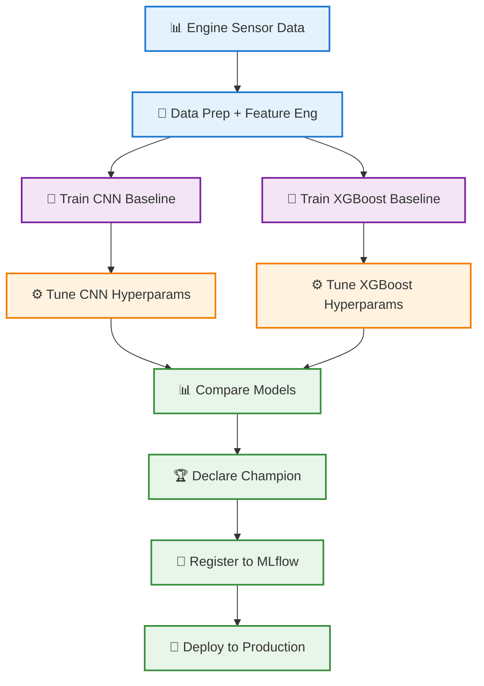

# Engine Health MLOps Pipeline

A comprehensive, production-ready MLOps pipeline for predicting engine health using PyTorch CNN and XGBoost models. This pipeline includes data preprocessing, model training, experiment tracking with MLflow, hyperparameter tuning with Optuna, Kubeflow pipeline orchestration, and model deployment with Kubernetes/KServe.

[](https://www.python.org/downloads/)
[](https://github.com/psf/black)

[COMPLETE_GUIDE.md](COMPLETE_GUIDE.md)

```bash
# Clone and setup
git clone https://github.com/LikithaMadana/engine-health-mlops.git
cd engine-health-mlops
make setup

# Train models
make train

# Start API
make serve
```
---

## Table of Contents

- [Features](#features)
- [Architecture](#architecture)
- [Project Structure](#project-structure)
- [Setup and Installation](#setup-and-installation)
- [Usage](#usage)
- [Training Models](#training-models)
- [Hyperparameter Tuning](#hyperparameter-tuning)
- [Kubeflow Pipeline](#kubeflow-pipeline)
- [Model Deployment](#model-deployment)
- [API Endpoints](#api-endpoints)
- [Metrics and Monitoring](#metrics-and-monitoring)
- [Documentation](#documentation)
- [Contributing](#contributing)
- [License](#license)

## Features

- **Modular Architecture**: Clean separation of concerns with dedicated modules for data, models, training, and utilities
- **Dual Model Support**: PyTorch 1D CNN and XGBoost models for engine health classification
- **Feature Engineering**: 103 engineered features for XGBoost (statistical, temporal, and domain-specific)
- **Complete ML Workflow**: Data Prep → Train → Tune → Compare → Champion → Register
- **Experiment Tracking**: Comprehensive MLflow integration for tracking experiments, parameters, and metrics
- **Hyperparameter Tuning**: Automated tuning using Optuna for both CNN and XGBoost models
- **Pipeline Orchestration**: Kubeflow Pipelines with 8 components for scalable, reproducible workflows
- **Production Deployment**: Optimized Docker images and Kubernetes manifests (standard K8s and KServe)
- **Low-Latency Inference**: Batch prediction support for improved throughput
- **Comprehensive Metrics**: Precision, Recall, F1 Score, AUC, and Accuracy tracking

## Results

### Champion Model Performance

**XGBoost (Champion)** - 97.44% F1 Score ✅
- Baseline F1: 96.94%
- After Tuning: **97.44%**
- Accuracy: 97.50%
- Precision: 98.82%
- Recall: 96.09%

**Best Hyperparameters:**
- max_depth: 4
- n_estimators: 74  
- learning_rate: 0.029
- subsample: 0.89
- colsample_bytree: 0.91

**CNN** - 96.30% F1 Score
- Baseline F1: 95.95%
- After Tuning: **96.30%**
- Accuracy: 97.00%
- Precision: 97.65%
- Recall: 94.99%

**Best Hyperparameters:**
- hidden_channels: 64
- learning_rate: 0.0012
- batch_size: 32

## Architecture

The pipeline follows a modern MLOps architecture. For detailed colorful diagrams, see [📊 Pipeline Diagrams](docs/PIPELINE_DIAGRAMS.md).

### Complete MLOps Pipeline Flow



**Pipeline Steps:**
1. **Data Preprocessing** - Load and prepare data (1000 samples)
2. **Feature Engineering** - Create 103 features for XGBoost
3. **Baseline Training** - Train both models with defaults
4. **Hyperparameter Tuning** - Optimize both models (10 trials each)
5. **Model Comparison** - Compare tuned models on test set
6. **Champion Selection** - Select best model (based on F1 score)
7. **Model Registration** - Register champion to MLflow Registry

**Current Champion:** XGBoost (97.44% F1 Score)

**Visual Resources:**
- **[Complete Pipeline Diagrams](docs/PIPELINE_DIAGRAMS.md)** - Colorful Mermaid diagrams showing detailed flows
- **[MLflow UI Guide](docs/MLFLOW_GUIDE.md)** - Screenshots and visualizations of experiment tracking

##  Project Structure

```
engine-health-mlops/
├── src/
│   ├── data/
│   │   ├── __init__.py
│   │   ├── preprocessing.py          # Data preprocessing utilities
│   │   └── feature_engineering.py    # Feature engineering for XGBoost
│   ├── models/
│   │   ├── __init__.py
│   │   ├── cnn_model.py              # PyTorch CNN model
│   │   └── xgboost_model.py          # XGBoost model
│   ├── training/
│   │   ├── __init__.py
│   │   ├── train_cnn.py              # CNN training with MLflow
│   │   ├── train_xgboost.py          # XGBoost training with MLflow
│   │   ├── tune_cnn.py               # CNN hyperparameter tuning
│   │   └── tune_xgboost.py           # XGBoost hyperparameter tuning
│   ├── utils/
│   │   ├── __init__.py
│   │   └── metrics.py                # Evaluation metrics
│   └── __init__.py
├── api/
│   ├── __init__.py
│   ├── inference.py                  # FastAPI inference service
│   └── latency_middleware.py         # Latency tracking middleware
├── tools/
│   ├── latency_benchmark.py          # Model latency benchmarking
│   └── api_latency_monitor.py        # API latency monitoring
├── kubeflow_pipeline/
│   ├── __init__.py
│   └── pipeline.py                   # KFP pipeline definition (8 components)
├── deployment/
│   ├── k8s-deployment.yaml           # Kubernetes deployment
│   └── kserve-inference.yaml         # KServe inference service
├── scripts/
│   ├── run_pipeline.py               # Complete pipeline execution
│   └── ...                           # Other utility scripts
├── tests/                            # Unit tests
├── Dockerfile                        # Multi-stage optimized Docker build
├── requirements.txt                  # Python dependencies
├── .gitignore
└── README.md
```

##  Setup and Installation

### Prerequisites

- Python 3.9+
- Docker (for containerization)
- Kubernetes cluster (for deployment)
- MLflow (for experiment tracking)
- Optuna (for hyperparameter tuning)

### Installation Steps

1. **Clone the repository**:
   ```bash
   git clone https://github.com/LikithaMadana/engine-health-mlops.git
   cd engine-health-mlops
   ```

2. **Create a virtual environment**:
   ```bash
   python -m venv venv
   source venv/bin/activate  # On Windows: venv\Scripts\activate
   ```

3. **Install dependencies**:
   ```bash
   pip install -r requirements.txt
   ```

4. **Set up MLflow tracking** (optional, defaults to local):
   ```bash
   # Start MLflow tracking server
   mlflow server --host 0.0.0.0 --port 5000
   
   # Set tracking URI (if using remote server)
   export MLFLOW_TRACKING_URI=http://localhost:5000
   ```

## Usage

### Complete Pipeline Execution

#### Run Full Pipeline (Recommended)

```bash
python scripts/run_pipeline.py --n-trials 10
```

**Complete Flow:**
1. **Data Preprocessing** - Generate/load data with 1000 samples
2. **Feature Engineering** - Create 103 engineered features for XGBoost
3. **Baseline Training** - Train both CNN and XGBoost with default parameters
4. **Hyperparameter Tuning** - Optimize both models using Optuna (10 trials each)
5. **Final Training** - Retrain models with tuned hyperparameters
6. **Champion Selection** - Compare models and declare champion (based on F1 score)
7. **Model Registration** - Register champion model to MLflow

**Options:**
- `--n-trials 10` - Number of Optuna trials for tuning (default: 10)
- `--skip-tuning` - Skip hyperparameter tuning for faster execution

**Expected Results:**
- **XGBoost (Champion)**: ~97.4% F1 Score
- **CNN**: ~96.3% F1 Score

#### Individual Model Training

##### Train CNN Model

```bash
cd src/training
python train_cnn.py
```

##### Train XGBoost Model

```bash
cd src/training
python train_xgboost.py
```

**XGBoost Feature Engineering:**
- **60 Statistical Features**: Mean, std, min, max, median, percentiles per sensor
- **30 Temporal Features**: Rate of change, trends, acceleration per sensor  
- **13 Domain-Specific Features**: Pressure ratios, temperature efficiency, load indicators

### Hyperparameter Tuning

Both models are automatically tuned in the main pipeline. For individual tuning:

#### CNN Tuning
```bash
python src/training/tune_cnn.py
```
**Parameters tuned:**
- Hidden channels (32, 64, 128)
- Learning rate (1e-4 to 1e-2)
- Batch size (16, 32, 64)

#### XGBoost Tuning
```bash
python src/training/tune_xgboost.py
```
**Parameters tuned:**
- Max depth (3-10)
- Number of estimators (50-300)
- Learning rate (0.01-0.3)
- Subsample (0.6-1.0)
- Colsample bytree (0.6-1.0)

### Kubeflow Pipeline

The Kubeflow pipeline implements the same complete workflow as the local pipeline.

#### Pipeline Components (8 total)

1. **preprocess-data** - Data preparation and feature engineering
2. **train-cnn** - Baseline CNN training
3. **train-xgboost** - Baseline XGBoost training  
4. **tune-hyperparameters** - CNN hyperparameter optimization
5. **tune-hyperparameters-2** - XGBoost hyperparameter optimization
6. **evaluate-models** - Compare model performances
7. **declare-champion** - Select champion based on F1 score
8. **register-to-mlflow** - Register champion to MLflow

#### Compile the Pipeline

```bash
cd kubeflow_pipeline
python pipeline.py
```

Generates: `complete_engine_health_pipeline.yaml` (62KB, 1108 lines)

#### Deploy to Kubeflow

```bash
# Upload YAML to Kubeflow UI or use CLI
kfp pipeline upload -p complete_engine_health_pipeline.yaml
```

#### Run the Pipeline

```python
from kfp import Client

client = Client(host='<your-kubeflow-host>')
client.create_run_from_pipeline_package(
    'complete_engine_health_pipeline.yaml',
    arguments={
        'n_samples': 1000,
        'n_trials': 10,
        'experiment_name': 'engine-health-production'
    }
)
```

**Pipeline Flow:**
```
Data Prep → Train (Both) → Tune (Both) → Evaluate → Champion → Register
```

## Model Deployment

### Build Docker Image

```bash
docker build -t engine-health-mlops:latest .
```

### Run Locally with Docker

```bash
# Create models directory and copy trained models
mkdir -p models

# Run container
docker run -p 8000:8000 \
  -v $(pwd)/models:/app/models \
  engine-health-mlops:latest
```

### Deploy to Kubernetes

#### Standard Kubernetes Deployment

```bash
kubectl apply -f deployment/k8s-deployment.yaml
```

This creates:
- A Deployment with 3 replicas
- A LoadBalancer Service
- A PersistentVolumeClaim for model storage

#### KServe Deployment (with autoscaling)

```bash
kubectl apply -f deployment/kserve-inference.yaml
```

This creates:
- Two InferenceServices (CNN and XGBoost)
- Horizontal Pod Autoscaler (2-10 replicas)
- Automatic scaling based on CPU/Memory

## API Endpoints

The inference API provides the following endpoints:

### Health Check

```bash
GET /health
```

Response:
```json
{
  "status": "healthy",
  "models_loaded": {
    "cnn": true,
    "xgboost": true
  }
}
```

### Single Prediction - CNN

```bash
POST /predict/cnn
```

Request:
```json
{
  "features": [0.1, 0.2, 0.3, 0.4, 0.5, 0.6, 0.7, 0.8, 0.9, 1.0, 1.1, 1.2, 1.3, 1.4]
}
```

Response:
```json
{
  "prediction": 0,
  "probability": 0.95,
  "probabilities": [0.95, 0.05]
}
```

### Single Prediction - XGBoost

```bash
POST /predict/xgboost
```

Request:
```json
{
  "features": [0.1, 0.2, 0.3, 0.4, 0.5, 0.6, 0.7, 0.8, 0.9, 1.0, 1.1, 1.2, 1.3, 1.4]
}
```

### Batch Prediction - CNN (Low Latency)

```bash
POST /predict/cnn/batch
```

Request:
```json
{
  "samples": [
    [0.1, 0.2, 0.3, 0.4, 0.5, 0.6, 0.7, 0.8, 0.9, 1.0, 1.1, 1.2, 1.3, 1.4],
    [0.2, 0.3, 0.4, 0.5, 0.6, 0.7, 0.8, 0.9, 1.0, 1.1, 1.2, 1.3, 1.4, 1.5]
  ]
}
```

### Batch Prediction - XGBoost (Low Latency)

```bash
POST /predict/xgboost/batch
```

##  Metrics and Monitoring

The pipeline tracks the following metrics:

- **Accuracy**: Overall prediction accuracy
- **Precision**: True positive rate
- **Recall**: Sensitivity/True positive rate
- **F1 Score**: Harmonic mean of precision and recall
- **AUC**: Area Under the ROC Curve
- **Train Loss**: Training loss (final epoch)

All metrics are logged to MLflow for comparison and analysis.

### View MLflow UI

```bash
mlflow ui --port 5000
```

Navigate to `http://localhost:5000` to view:
- Experiment runs
- Hyperparameter comparisons
- Metric visualizations
- Model artifacts

### Latency Measurement & Optimization

For real-time automotive applications, we provide tools to measure and ensure low inference latency (target: <100ms):

**1. Model Latency Benchmark** (`tools/latency_benchmark.py`)
- Measures model inference latency (P95, P99 percentiles)
- Includes warmup and statistical analysis
- Supports model quantization for faster inference
- ONNX export for optimized deployment

```bash
python tools/latency_benchmark.py
```

**2. API Latency Monitor** (`tools/api_latency_monitor.py`)
- End-to-end API latency testing
- Real-time monitoring of deployed API
- Measures P95/P99 latency under load

```bash
python tools/api_latency_monitor.py
```

**3. Latency Middleware** (`api/latency_middleware.py`)
- FastAPI middleware for automatic latency tracking
- Prometheus metrics integration
- Adds latency header to responses
- Real-time monitoring in production

## Architecture Decisions

### 1. Modular Design
- **Rationale**: Separation of concerns allows independent development and testing of components
- **Benefits**: Easy to maintain, test, and extend

### 2. Dual Model Approach
- **CNN**: Captures temporal patterns in sensor readings using raw windowed data (10 timesteps × 6 sensors)
- **XGBoost**: Uses 103 engineered features (statistical, temporal, and domain-specific) for interpretable predictions
- **Benefits**: Model comparison, feature importance analysis, and ensemble potential

**Why Feature Engineering for XGBoost?**
- CNN learns features automatically through convolutional layers
- XGBoost (tree-based) needs explicit features to perform well on time-series data
- Engineered features capture domain knowledge (pressure ratios, thermal efficiency, etc.)

### 3. MLflow for Experiment Tracking
- **Rationale**: Industry-standard tool for ML lifecycle management
- **Benefits**: Version control, reproducibility, model registry

### 4. Optuna for Hyperparameter Tuning
- **Rationale**: Efficient search algorithms (TPE) and pruning
- **Benefits**: Faster convergence, better hyperparameters

### 5. Kubeflow Pipelines
- **Rationale**: Cloud-agnostic orchestration for ML workflows
- **Benefits**: Reproducibility, scalability, versioning

### 6. FastAPI for Inference
- **Rationale**: High performance, automatic documentation
- **Benefits**: Fast, type-safe, modern async support

### 7. Multi-stage Docker Build
- **Rationale**: Minimize image size, separate build and runtime dependencies
- **Benefits**: Faster deployments, reduced attack surface

### 8. KServe for Model Serving
- **Rationale**: Kubernetes-native, serverless, autoscaling
- **Benefits**: Cost-effective, scales with demand

## Documentation

- **[Feature Engineering Guide](docs/FEATURE_ENGINEERING.md)**: Complete guide to the 103 engineered features for XGBoost
- **[Complete Pipeline Guide](docs/COMPLETE_GUIDE.md)**: End-to-end pipeline documentation
- **[MLflow Integration](docs/MLFLOW_GUIDE.md)**: Experiment tracking and model registry
- **[Pipeline Diagrams](docs/PIPELINE_DIAGRAMS.md)**: Visual workflow diagrams
- **[API Documentation](http://localhost:8000/docs)**: Available when running the API
- **[MLflow UI](http://localhost:5000)**: Experiment tracking interface

